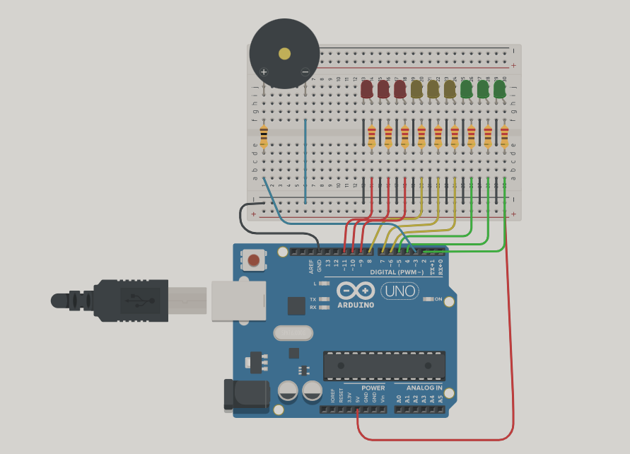

# Dojo1_Spd
<h1> Dojo Numero 1</h1>
 
 <h2>Integrantes:</h2>
   Ingrid Natalia Ely
   Vazquez Micaela
   Aldana Olivera
   Milagros Vanesa Bogliano
   Manuel Bastos Gonzalez
  <h2> Proyecto:</h2>
   
 <h2> Descripcion:</h2>
 El semáforo cuenta con 3 led de cada color y como tiene que tener señalización para personas no videntes, el buzzer en distintos tiempos segun los leds que esten encendidos.
<h2> Funcion principal:</h2>
 
<h2> Link al proyecto:</h2>
 https://www.tinkercad.com/things/kVGsLRHheSs-dojo1/editel?sharecode=L6UKvwPLMAkwNNJXLWdEm8D8b6wGFzsnyoKWmPJqlmU
