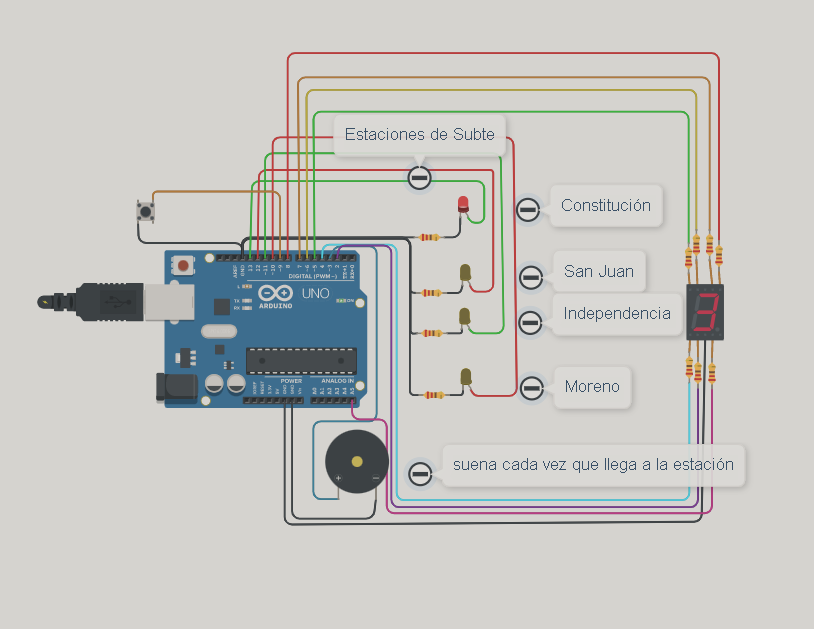
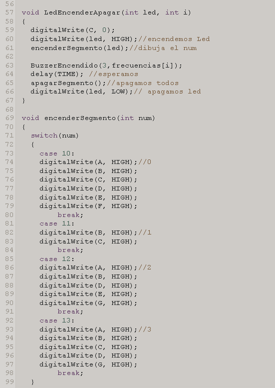
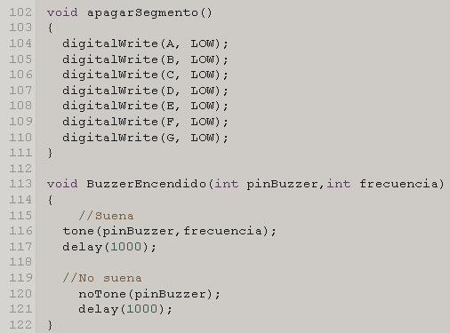

# Spd 
<h1> Dojo 2   </h1>
<h2> Integrantes </h2>
<ul>
<li>Ingrid Natalia Ely</li>
<li>Vazquez Micaela</li>
<li>Aldana Olivera</li>
<li>Milagros Vanesa Bogliano</li>
<li>Manuel Bastos Gonzalez</li>
</ul>
<h2> Proyecto : Estación de subte</h2>
 
<h2> Descripción</h2>

La simulación comienza al tocar el botón una vez. Cada led representá una estación y en el 7 Segmentos se muestra la cantidad de estaciones que faltán para llegar a la estacion Moreno (ultimo led), y cada vez que se enciende un led suena una vez el buzzer simulando así la llegada a la distintas estaciones.

<h2> Función Principal</h2>
 
 

<h2> Link al proyecto</h2>

https://www.tinkercad.com/things/f745EOw9kos-dojo-2/editel?sharecode=tU5LuJSTOX6YFpeb7OT8jqkdg52voF0WcZ2nupE6ZcM

